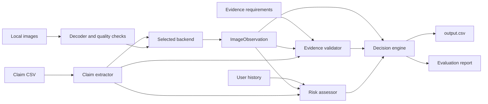

# Multimodal Insurance Claim Verification System


A modular Python pipeline for reviewing structured damage claims involving cars,
laptops, and packages. It combines multilingual claim extraction, local image
validation, evidence requirements, user-history risk context, configurable
analysis backends, and deterministic decisions.

The default submission uses the **Rules backend** because it is reproducible,
offline, lightweight, and practical on CPU-only hardware. Hugging Face, Ollama,
and OpenAI remain available when semantic image understanding is needed.

> [!IMPORTANT]
> The Rules backend opens and technically validates image files, but it does not
> infer objects or damage from image pixels. Semantic fields are derived from
> reusable conversation-extraction and policy rules.

## 📌 Project Overview

The system reads claim conversations, submitted local images, user claim history,
and minimum evidence requirements. It produces issue, part, evidence, risk,
status, supporting-image, and severity fields using the exact challenge schema.

## ✨ Features

- Four interchangeable backends behind one `ImageObservation` contract.
- Deterministic default with no network, model, or API dependency.
- English, Hindi, Hinglish, and Spanish keyword normalization.
- Local image existence, decoding, dimensions, brightness, and blur checks.
- CSV-driven evidence validation and user-history risk propagation.
- Prompt-injection phrase detection and manual-review escalation.
- Deterministic severity, supporting-image, and claim-decision rules.
- Backend-aware caching, telemetry, logging, and per-claim failure isolation.
- Evaluation that generates predictions before reading expected fields.
- No hardcoded case IDs, filenames, user IDs, answers, or expected labels.

## 🏗️ System Architecture



Every backend returns the same structured observation. Evidence, risk, decisions,
and serialization remain deterministic downstream.

## 🔄 Pipeline

1. Read `claims.csv`, `user_history.csv`, and `evidence_requirements.csv`.
   Evaluation reads `sample_claims.csv` through its separate entry point.
2. Extract claimed object, part, issue, qualifiers, and instruction-risk phrases.
3. Resolve every image path and validate file existence, decoding, dimensions,
   brightness, and an edge-variance blur indicator.
4. Run the selected Rules, Hugging Face, Ollama, or OpenAI backend.
5. Normalize backend output into a structured `ImageObservation`.
6. Apply the relevant minimum evidence requirements.
7. Add technical, instruction-text, and user-history risk flags. History adds
   context only and does not override evidence.
8. Combine intent, observations, evidence, and risk in the decision engine.
9. Validate and write the exact `output.csv` schema plus telemetry.
10. Generate sample predictions, metrics, and `evaluation_report.md`.

## 🔌 Backend Options

| Backend | Runs Offline | Requires API | CPU Friendly | Image Understanding | Recommended Use |
|---|---:|---:|---:|---|---|
| **Rules** | Yes | No | **Yes** | No semantic pixel understanding; technical validation only | Default submission and constrained hardware |
| **Hugging Face** | After download | No | Limited | Local SmolVLM caption-based understanding | Offline VLM experiments |
| **Ollama** | After download | No | Limited on 8 GB RAM | Local Qwen2.5-VL understanding | Higher-memory or accelerated systems |
| **OpenAI** | No | Yes | Yes locally; remote inference | Strongest configured vision option | Cloud analysis when API use is allowed |

## ⚙️ Rule-Based Backend (Default)

The default backend is deterministic, offline, CPU-friendly, and makes no model
or API calls. It still reads and validates every referenced image.

Capabilities include:

- claim extraction and multilingual keyword/negation handling;
- image existence, decoding, dimension, blur, and brightness validation;
- evidence rules and conservative missing-contents handling;
- deterministic issue and severity estimation from claim language;
- single-best supporting-image selection by default;
- multiple IDs only when claim text explicitly requires joint evidence;
- ordered risk flags from technical checks, instruction phrases, and history;
- deterministic claim status and concise rules-grounded explanations.

Rules-backend explanations avoid claiming that pixels visibly prove damage.

## 📁 Project Structure

```text
.
├── README.md
├── problem_statement.md
├── dataset/
│   ├── claims.csv
│   ├── sample_claims.csv
│   ├── user_history.csv
│   ├── evidence_requirements.csv
│   └── images/
├── code/
│   ├── main.py
│   ├── config.py
│   ├── claim_extractor.py
│   ├── image_analyzer.py
│   ├── evidence_validator.py
│   ├── risk_assessor.py
│   ├── decision_engine.py
│   ├── utils.py
│   ├── requirements.txt
│   ├── .env.example
│   └── evaluation/
│       ├── main.py
│       ├── metrics.json
│       ├── sample_predictions.csv
│       └── evaluation_report.md
├── output.csv
└── output.telemetry.json
```

## 📦 Installation

Python 3.11 or newer is recommended. Run commands from the repository root.

```bash
python -m venv .venv
pip install -r code/requirements.txt
```

Activate on Windows with `.\.venv\Scripts\Activate.ps1`, or on Linux/macOS
with `source .venv/bin/activate`.

### Rules backend

```bat
set VISION_BACKEND=rules
python code/evaluation/main.py --refresh-cache
```

### Hugging Face backend

The configured default is the canonical SmolVLM2 500M checkpoint:

```bat
set VISION_BACKEND=huggingface
set HF_MODEL=HuggingFaceTB/SmolVLM2-500M-Video-Instruct
python code/evaluation/main.py --refresh-cache
```

The earlier SmolVLM checkpoint can also be selected on compatible Transformers
versions:

```bat
set HF_MODEL=HuggingFaceTB/SmolVLM-500M-Instruct
```

Local inference can require significant CPU time on an 8 GB laptop.

### Ollama backend

```bat
ollama pull qwen2.5vl:7b
set VISION_BACKEND=ollama
set OLLAMA_MODEL=qwen2.5vl:7b
python code/evaluation/main.py --refresh-cache
```

### OpenAI backend

```bash
pip install openai
```

```bat
set VISION_BACKEND=openai
set OPENAI_API_KEY=YOUR_KEY
python code/evaluation/main.py --refresh-cache
```

Never commit API keys or local `.env` files.

## ▶️ Usage

Generate final predictions:

```bash
python code/main.py --refresh-cache
```

Or provide explicit paths:

```bash
python code/main.py --input dataset/claims.csv --output output.csv --dataset-dir dataset --refresh-cache
```

This writes `output.csv` and `output.telemetry.json`.

## 📊 Evaluation

```bash
python code/evaluation/main.py --refresh-cache
```

The workflow generates sample predictions before loading expected fields, then
writes `metrics.json`, `sample_predictions.csv`, telemetry, and
`evaluation_report.md` under `code/evaluation/`.

### Latest Rules-backend results

| Metric | Score |
|---|---:|
| Claim Status | **70%** |
| Object Part | **90%** |
| Evidence Standard | **85%** |
| Valid Image | **95%** |
| Issue Type | **65%** |
| Severity | **60%** |
| Risk Flags F1 | **74.33%** |
| Supporting Image IDs | **70%** |
| Full Row Accuracy | **50%** |

The measured final run processed 44 claims and 82 images with zero model calls
and zero processing errors. Results describe the provided sample dataset and are
not a general production-accuracy claim.

## 🔧 Configuration

Configuration is centralized in `code/config.py`. Variables may be set in the
shell or in an uncommitted `code/.env` file.

| Variable | Default | Purpose |
|---|---|---|
| `VISION_BACKEND` | `rules` | Selects `rules`, `huggingface`, `ollama`, or `openai` |
| `VISION_MODEL` | Backend default | Overrides the selected model identifier |
| `HF_MODEL` | `HuggingFaceTB/SmolVLM2-500M-Video-Instruct` | Hugging Face checkpoint |
| `HF_DEVICE` | `cpu` | Hugging Face device |
| `HF_CPU_THREADS` | Up to 4 | Local CPU inference threads |
| `HF_MAX_NEW_TOKENS` | `256` | Maximum local caption length |
| `HF_LOCAL_FILES_ONLY` | `false` | Disables model network access after download |
| `OLLAMA_MODEL` | `qwen2.5vl:7b` | Ollama model tag |
| `OLLAMA_URL` | `http://localhost:11434` | Ollama service URL |
| `OPENAI_API_KEY` | unset | OpenAI credential |
| `OPENAI_VISION_MODEL` | `gpt-5.5` | OpenAI model identifier |
| `MAX_IMAGE_SIDE` | `1024` | Maximum encoded image dimension |
| `CLAIM_REVIEW_CACHE` | `code/.cache` | Backend-aware cache directory |
| `LOG_LEVEL` | `INFO` | Runtime logging level |

Cache keys include image bytes, extracted claim, backend, model, and prompt
version, preventing incompatible results from crossing backends.

## 🧾 Output Format

`output.csv` contains exactly these columns in order:

| # | Column | Description |
|---:|---|---|
| 1 | `user_id` | Input claimant identifier |
| 2 | `image_paths` | Original semicolon-separated image paths |
| 3 | `user_claim` | Original conversation |
| 4 | `claim_object` | `car`, `laptop`, or `package` |
| 5 | `evidence_standard_met` | `true` or `false` |
| 6 | `evidence_standard_met_reason` | Concise evidence explanation |
| 7 | `risk_flags` | Ordered flags or `none` |
| 8 | `issue_type` | Normalized issue enum |
| 9 | `object_part` | Allowed part for the object |
| 10 | `claim_status` | `supported`, `contradicted`, or `not_enough_information` |
| 11 | `claim_status_justification` | Concise decision explanation |
| 12 | `supporting_image_ids` | Supporting IDs or `none` |
| 13 | `valid_image` | `true` or `false` |
| 14 | `severity` | `none`, `low`, `medium`, `high`, or `unknown` |

## 🧠 Design Decisions

- **Rules by default:** deterministic, reproducible, low latency, and suitable
  for CPU-only systems.
- **Honest boundaries:** the Rules backend performs technical image validation,
  not semantic pixel interpretation. Optional VLM backends attempt the latter.
- **One observation contract:** every backend returns `VisionResult`, which is
  converted to the unchanged `ImageObservation` structure.
- **Deterministic policy:** evidence, risk, support selection, decisions, enums,
  and serialization are controlled by Python rules.
- **History is context:** history adds risk flags but does not override evidence.
- **Conservative contents review:** exterior package images do not prove missing
  contents without explicit opened-package evidence.
- **No answer memorization:** inference contains no dataset answers, case IDs,
  filenames, user IDs, or expected labels. Samples are used only in evaluation.
- **Backend-isolated caching:** model output from one backend cannot affect another.

## 🛠️ Technologies Used

| Technology | Role |
|---|---|
| Python 3.11+ | Application and evaluation runtime |
| Pydantic | Structured backend schema and validation |
| Pillow | Image decoding, resizing, brightness, and edge checks |
| python-dotenv | Local environment configuration |
| PyTorch | Optional Hugging Face runtime |
| Transformers | Optional SmolVLM loading and inference |
| Accelerate | Memory-conscious optional model loading |
| Safetensors | Optional local model weights |
| Ollama | Optional Qwen2.5-VL serving |
| OpenAI Responses API | Optional cloud vision backend |
| Python `csv`, `json`, and `logging` | Data I/O, telemetry, and diagnostics |

## 🚀 Future Improvements

- Add lightweight classical computer vision for stronger obstruction,
  non-original-image, and orientation signals without a VLM.
- Benchmark quantized local VLMs that fit comfortably within 8 GB RAM.
- Add calibrated backend confidence and optional ensemble policies.
- Expand multilingual coverage using held-out, non-dataset-specific tests.
- Add unit and integration tests for every enum, adapter, and failure mode.
- Rank supporting images using independent visual relevance signals.
- Add bounded-memory parallel processing.

## 📄 License

No open-source license file is currently included. This project was produced for
the HackerRank Orchestrate challenge and remains subject to the challenge and
repository terms. Add an explicit license before redistribution or reuse outside
that context.
